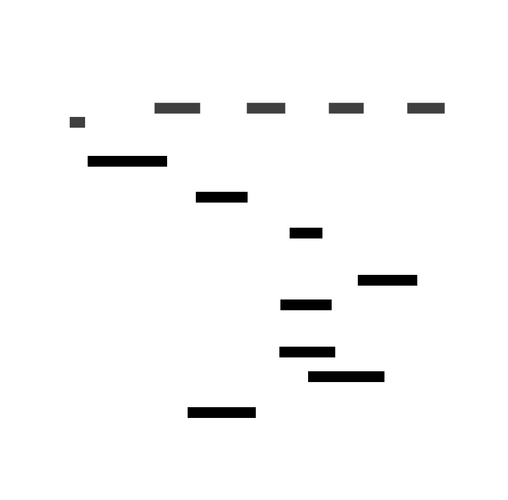

# Square Number DSS

The Square Number DSS serves as a fundamental example, specifically crafted to illustrate the basic interactions between the Distributed Secure Service (DSS) and the Karak Restaking mechanism. 

It provides a straightforward, clear-cut case that showcases how users, aggregators, and operators within the DSS ecosystem work together to process a computational task. This example is essential for understanding the core principles of how DSS utilizes economic security from restaked tokens, handles task requests, and ensures accurate and reliable results through collective validation and the potential for operator accountability.

## Installation and Setup

### Prerequisites
- docker engine installed and running on your machine - https://docs.docker.com/engine/install/
- docker compose installed - https://docs.docker.com/compose/install/
- Availability of ports 8080, 8081, 8454, 3000 (You can change the ports in docker-compose.yaml if needed)

### Running the Containers

`docker-compose up --build`

#### Containers:
- anvil
- contract-deployer
- operator-1
- operator-2
- aggregator

### Calling the DSS
When the DSS is deployed you can check the address in the `contracts/contract-addresses.json` file. 

Using those addresses you can make the following cast call to submit a task request for squaring a number:
```bash 
cast send 0x9A9f2CCfdE556A7E9Ff0848998Aa4a0CFD8863AE "generateTaskRequest((uint256))" "(5)" --private-key 0x59c6995e998f97a5a0044966f0945389dc9e86dae88c7a8412f4603b6b78690d --rpc-url http://localhost:8545
```

Wait for about 10-20 seconds to allow the operators to pick up and finish the task and then using a cast call you can check the result as follows:
```bash
cast call 0x9A9f2CCfdE556A7E9Ff0848998Aa4a0CFD8863AE "getTaskResponse((uint256))(uint256)" "(5)" --rpc-url http://localhost:8545
```

## Architecture


In order to significantly reduce trust assumptions on the aggregator, an alternative architecture can be implemented using BLS signatures instead of individual ECDSA signatures. BLS signatures offer the capability of aggregation, allowing the aggregator to consolidate signatures from a majority of operators who present a consistent response.

**BLS Signatures**

Instead of each operator using individual ECDSA signatures, they generate BLS signatures for their respective responses. BLS signatures can be aggregated by the aggregator into a single combined signature.
Aggregator's Role

The aggregator, as a central entity within the DSS, collects responses from operators after they calculate the squared number. Instead of simply forwarding individual responses, the aggregator aggregates the BLS signatures of the majority of operators who agree on the computed result.

**Verification Process**

Upon receiving the aggregated BLS signature from the aggregator, the on-chain DSS contract performs verification. It checks whether the aggregated signature represents a stake-weighted majority of operators. This verification ensures that the response aligns with the consensus of operators holding the majority stake.

**Outcome**

If the aggregated BLS signature passes verification against the stake-weighted majority, the DSS contract accepts the response. This method reduces dependence on the aggregator for the accuracy of submitted data, as the consensus of stakeholders holds more sway in determining the validity of the response.


Implementing BLS signatures in this manner enhances the integrity and reliability of the DSS process. It leverages stake-weighted consensus among operators to minimize the risk of erroneous or manipulated responses by the aggregator, thereby fortifying the overall trustworthiness of the system.

## Flow Diagram
The following flow diagram should be able to give you a brief overview of the entire working of the square number DSS.

